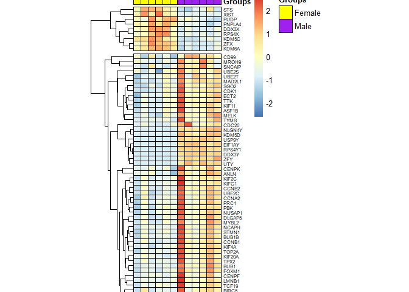
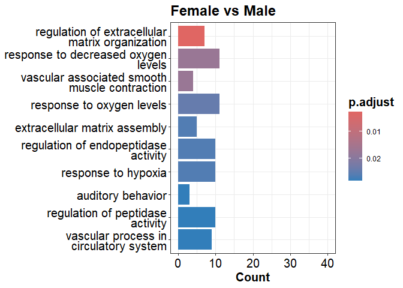
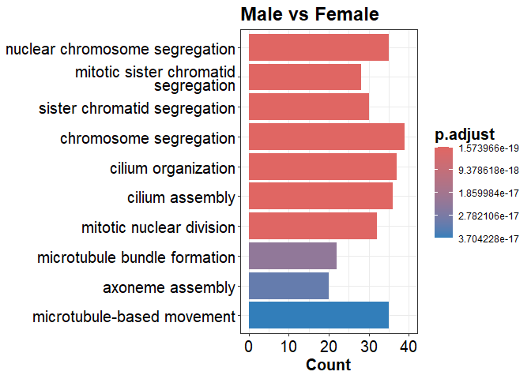

demographic_cohorts_background_differences
================
Arun Ghosh
2024-09-04

BACKGROUND DIFFERENCES based on DEMOGRAPHIC COHORTS

``` r
library(edgeR)
library(AnnotationDbi)
library(org.Hs.eg.db)
library(dplyr)
library(stringr)
library(ggplot2)
library(eulerr)
library(purrr)
library(ggVennDiagram)
library(tidyverse)
library(pheatmap)
library(RColorBrewer) 
organism = "org.Hs.eg.db"
library(organism, character.only = TRUE)
library(clusterProfiler)
library(readxl)
library(enrichplot)
library(openxlsx)

counts <- read.delim("counts_7G.txt", row.names = 1) # reading in RNAseq data

###############################################################################
##  Analysis without donor specific correction  ###############################

d0 <- DGEList(counts)# Create DGEList object
d0 <- calcNormFactors(d0)
cutoff <- 10 # genes expressed in at least 10 samples to be included
drop <- which(apply(cpm(d0), 1, max) < cutoff)
d <- d0[-drop,] 
dim(d) # number of genes left
```

``` r
snames <- colnames(counts) # Sample names

# for identification of non-smoker and smoker donors
nvs <- substr(snames, 1, (nchar(snames)-6))
nvs <- as.factor(nvs)
nvs
```

``` r
# for identification of female and male donors
fvm <- substr(snames, 2, (nchar(snames)-5))
fvm <- as.factor(fvm)
fvm
```

``` r
# for exposure groups
exposure <- substr(snames, nchar(snames)-3, (nchar(snames)-1))
exposure
```

``` r
# for comparison between non-smoker and smoker donors
group2 <- interaction(nvs, exposure)
group2
```

``` r
# for comparison between female and male donors
group3 <- interaction(fvm, exposure)
group3
```

``` r
#----------------------------------------------------#

mm9 <- model.matrix(~0+group2) # non-smoker and smoker donors
y9 <- voom(d, mm9, plot = T)
```

<!-- -->

FIGURE S5

``` r
# plotting based on smoking status
df1 <- as.data.frame(y9$E)
df1 <- df1 %>% select(ends_with("CTRL"))
nvsLabels <- substr(colnames(df1), 1, (nchar(colnames(df1))-6))
nvsLabels <- str_replace_all(nvsLabels, c(N= "Non-smoker",
                                    S= "Smoker"))
mds <- plotMDS(df1,  pch = 19, cex = 1.2, labels = nvsLabels, gene.selection = "pairwise",
               col=c(rep("darkgreen",6), rep("blue",6)))
```

<!-- -->

``` r
fit9 <- lmFit(y9, mm9) # Fitting linear models in limma

head(coef(fit9))

x <- colnames(coef(fit9))
length(x)
x # to see the groups

b9 <- list() # for storing analyzed data for significantly altered genes


  contr <- makeContrasts(group2S.CTR-group2N.CTR, levels = colnames(coef(fit9)))
  tmp <- contrasts.fit(fit9, contr)
  tmp <- eBayes(tmp)
  top.table <- topTable(tmp, sort.by = "P", n = Inf)
  top.table <- as.data.frame(top.table)
  try(top.table$symbol <- mapIds(org.Hs.eg.db, keys = row.names(top.table), 
                                 keytype = "ENSEMBL", column = "SYMBOL", 
                                 multiVals="first")) #adding gene names 
  top.table <- subset(top.table, top.table$symbol != 'NA')
  top.table<- top.table %>% 
    mutate(direction = case_when(logFC > 0.5 ~ "up",
                                 logFC < -0.5 ~ "down"))
  top.table <- top.table[(which(top.table$adj.P.Val < 0.1 & 
                                  abs(top.table$logFC) > 0.5)),]
  top.table <- top.table [(c(7,1,2,3,4,5,6,8))]
  b9 <- top.table
  
###############################################################

counts_CTRL <- counts %>% select(ends_with("CTRL")  ) # selecting control samples

#  Non-smokers vs Smokers

counts_CTRL_NvS <- subset(counts_CTRL, rownames(counts_CTRL) %in% rownames(b9))

counts_CTRL_NvS <- as.data.frame(counts_CTRL_NvS, header = TRUE)
counts_CTRL_NvS$symbol <- mapIds(org.Hs.eg.db, keys = row.names(counts_CTRL_NvS), 
                                 keytype = "ENSEMBL", column = "SYMBOL", 
                                 multiVals="first") #adding gene names 
counts_CTRL_NvS <- subset(counts_CTRL_NvS, counts_CTRL_NvS$symbol != 'NA')
ncol(counts_CTRL_NvS)
rownames(counts_CTRL_NvS) <- NULL
rownames(counts_CTRL_NvS) <- counts_CTRL_NvS$symbol
counts_CTRL_NvS <- counts_CTRL_NvS[,1:(ncol(counts_CTRL_NvS)-1)]

x <- as.data.frame(colnames(counts_CTRL_NvS))
colnames(x) <- "Groups"
rownames(x) <- x$Groups
x$Groups <-  sub("[[:digit:]]+","", x$Groups)
substr(x$Groups, 2, 3) <- '-'
x$Groups <- gsub('-', '', x$Groups)
x$Groups <- str_replace_all(x$Groups,
                            c(NCTRL= "Nonsmoker", 
                              SCTRL= "Smoker"))

x2 = list( Groups = c(Nonsmoker="yellow", Smoker="purple"))
temp3 <- as.matrix(counts_CTRL_NvS)
pheatmap(temp3, 
         color = colorRampPalette(rev(brewer.pal(n = 7, name ="RdYlBu")))(100), 
         display_numbers = FALSE,
         number_color = "black",
         fontsize_number = 5,
         angle_col = c("45"), 
         cellwidth = 10, 
         cellheight = 10, 
         border_color = "black",
         annotation_col = x,
         annotation_colors = x2,
         show_colnames = F,
         treeheight_col = 1, 
         fontsize_row = 7, 
         scale = 'row', 
         fontsize_col = 7, 
         cutree_rows = 2,
         cluster_cols = FALSE, 
         cluster_rows = TRUE)
```

<!-- -->

FIGURE 5

``` r
mm10 <- model.matrix(~0+group3) # female and male donors
y10 <- voom(d, mm10, plot = T)
```

<!-- -->

``` r
# plotting based on sex
df2 <- as.data.frame(y10$E)
df2 <- df2 %>% select(ends_with("CTRL"))
fvmLabels <- substr(colnames(df2), 2, (nchar(colnames(df2))-5))
fvmLabels <- str_replace_all(fvmLabels, c(F= "Female",
                                    M= "Male"))
mds <- plotMDS(df2,  pch = 19, cex = 1.2, labels = fvmLabels, gene.selection = "pairwise",
               col=c(rep("darkgreen",3), rep("blue",3)))
```

<!-- -->

``` r
fit10 <- lmFit(y10, mm10) # Fitting linear models in limma
  
head(coef(fit10))
```

``` r
x <- colnames(coef(fit10))
length(x)
x # to see the groups

b10 <- list() # for storing analyzed data fro significantly altered genes
c10 <- list() # for getting the list of all genes

  contr <- makeContrasts(group3F.CTR-group3M.CTR, levels = colnames(coef(fit10)))
  tmp <- contrasts.fit(fit10, contr)
  tmp <- eBayes(tmp)
  top.table <- topTable(tmp, sort.by = "P", n = Inf)
  top.table <- as.data.frame(top.table)
  try(top.table$symbol <- mapIds(org.Hs.eg.db, keys = row.names(top.table), 
                                 keytype = "ENSEMBL", column = "SYMBOL", 
                                 multiVals="first")) #adding gene names 
  top.table <- subset(top.table, top.table$symbol != 'NA')
  c10 <- top.table
  
  top.table<- top.table %>% 
    mutate(direction = case_when(logFC > 0.5 ~ "up",
                                 logFC < -0.5 ~ "down"))
  top.table <- top.table[(which(top.table$adj.P.Val < 0.1 & 
                                  abs(top.table$logFC) > 0.5)),]
  top.table <- top.table [(c(7,1,2,3,4,5,6,8))]
  b10 <- top.table


###############################################################
#  Female vs Male
  
counts_CTRL_FvM <- subset(counts_CTRL, rownames(counts_CTRL) %in% rownames(b10))
  
counts_CTRL_FvM <- as.data.frame(counts_CTRL_FvM, header = TRUE)
counts_CTRL_FvM$symbol <- mapIds(org.Hs.eg.db, keys = row.names(counts_CTRL_FvM), 
                                   keytype = "ENSEMBL", column = "SYMBOL", 
                                   multiVals="first") #adding gene names 
counts_CTRL_FvM <- subset(counts_CTRL_FvM, counts_CTRL_FvM$symbol != 'NA')
ncol(counts_CTRL_FvM)
rownames(counts_CTRL_FvM) <- NULL
rownames(counts_CTRL_FvM) <- counts_CTRL_FvM$symbol
counts_CTRL_FvM <- counts_CTRL_FvM[,1:(ncol(counts_CTRL_FvM)-1)]

x <- as.data.frame(colnames(counts_CTRL_FvM))
colnames(x) <- "Groups"
rownames(x) <- x$Groups
x$Groups <-  sub("[[:digit:]]+","", x$Groups)
x$Groups <- substring(x$Groups,2,6)
x$Groups <- gsub('-', '', x$Groups)
x$Groups <- str_replace_all(x$Groups,
                            c(FCTRL= "Female", 
                              MCTRL= "Male"))


x2 = list( Groups = c(Female="yellow", Male="purple"))

temp4 <- as.matrix(counts_CTRL_FvM)
pheatmap(temp4, 
           color = colorRampPalette(rev(brewer.pal(n = 7, name ="RdYlBu")))(100), 
           display_numbers = FALSE,
           number_color = "black",
           fontsize_number = 5,
           angle_col = c("45"), 
           cellwidth = 10, 
           cellheight = 7, 
           border_color = "black",
           annotation_col = x,
           annotation_colors = x2,
           show_colnames = F, 
           treeheight_col = 1, 
           fontsize_row = 7, 
           scale = 'row', 
           fontsize_col = 7, 
           cutree_rows =  2, 
           cluster_cols = TRUE, 
           cluster_rows = TRUE)
```

<!-- -->

``` r
GdataFvM <- c10 

##########################################################################
#---------------------------------------------#
# comparing between background expression between female and male donors

GdataFvM <- GdataFvM %>% mutate(ProbeID = rownames(GdataFvM))   

GdataFvM <- select(GdataFvM, ProbeID, logFC)
rownames(GdataFvM) <- NULL

#making ranked gene list
genelist_GdataFvM = GdataFvM[,2] #numeric vector
names(genelist_GdataFvM) = as.character(GdataFvM[,1]) #named vector
genelist_GdataFvM = sort(genelist_GdataFvM, decreasing = TRUE) #must sort in descending order

#Performing GSEA analysis
#Gene Ontology (GO) 
gseGO_FvM_ALL <- gseGO(geneList=genelist_GdataFvM, 
                       ont ="ALL", 
                       keyType = "ENSEMBL", 
                       minGSSize = 10, #min size of gene sets for analysis
                       maxGSSize = 500, #max size of gene sets for analysis
                       pvalueCutoff = 0.05, 
                       eps = 0,
                       verbose = TRUE, 
                       OrgDb = organism, 
                       pAdjustMethod = "BH")

enrichplot::dotplot(gseGO_FvM_ALL, split=".sign", title = "Female vs Male",
                    showCategory = 10, font.size = 15, label_format = 70) + facet_grid(.~.sign)
```

<!-- -->

``` r
enrichplot::dotplot(gseGO_FvM_ALL, split=".sign", title = "Female vs Male",
                    showCategory = 10, font.size = 15, label_format = 70)+ facet_grid(.~.sign)+ 
  scale_x_continuous(breaks = seq(0, 1, by = 1), limits=c(0,1))+
  theme(axis.text.y = element_text(lineheight = 0.80, size = 15),
        title = element_text(size = 15, face="bold"),
        plot.title = element_text(hjust=0.5))
```

<!-- -->

FIGURE S6

``` r
#GO over-representation analysis in female donors
geneFvM <- names(genelist_GdataFvM[genelist_GdataFvM[] > 0.5]) # logFC > 0.5
enGOFvM <- enrichGO(gene         = geneFvM,
                    OrgDb         = org.Hs.eg.db,
                    keyType       = 'ENSEMBL',
                    ont           = "ALL",
                    pAdjustMethod = "BH",
                    pvalueCutoff  = 0.05,
                    qvalueCutoff  = 0.1)
head(enGOFvM)
```

``` r
#barplot
barplot(enGOFvM, showCategory=10, font = 15, title = "Female vs Male")+
  scale_x_continuous(breaks = seq(0, 40, by = 10), limits=c(0,40))+
  theme(axis.text.y = element_text(lineheight = 0.7, size = 15),
        title = element_text(size = 15, face="bold"))
```

<!-- -->

``` r
#------------------------------------------------------------------#
#GO over-representation analysis in male donors
geneMvF <- names(genelist_GdataFvM[genelist_GdataFvM[] < -0.5]) # logFC < -0.5
enGOMvF <- enrichGO(gene         = geneMvF,
                    OrgDb         = org.Hs.eg.db,
                    keyType       = 'ENSEMBL',
                    ont           = "ALL",
                    pAdjustMethod = "BH",
                    pvalueCutoff  = 0.05,
                    qvalueCutoff  = 0.1)
head(enGOMvF)
```

``` r
#barplot
barplot(enGOMvF, showCategory=10, font = 15, title = "Male vs Female")+
  scale_x_continuous(breaks = seq(0, 40, by = 10), limits=c(0,40))+
  theme(axis.text.y = element_text(lineheight = 0.7, size = 15),
        title = element_text(size = 15, face="bold"))
```

<!-- -->

``` r
#-----------------------------------------------------------------#  
  
BG <- list()

BG$Nonsmoker_vs_Smoker <- b9
BG$Female_vs_Male <- b10

#---------------------------------------------------#
BG <- BG %>% lapply(arrange, direction)
blank_excel <- createWorkbook()

Map(function(df, tab_name){     
  
  addWorksheet(blank_excel, tab_name)
  writeData(blank_excel, tab_name, df)
}, 

BG, names(BG)
)

saveWorkbook(blank_excel, file = "Table S2.xlsx", overwrite = TRUE)
#-----------------------------------------------------------------# 
```
