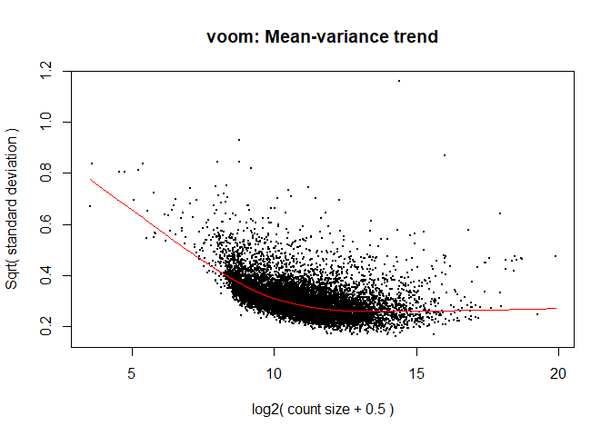
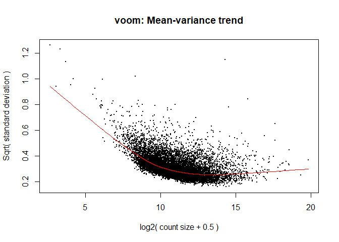
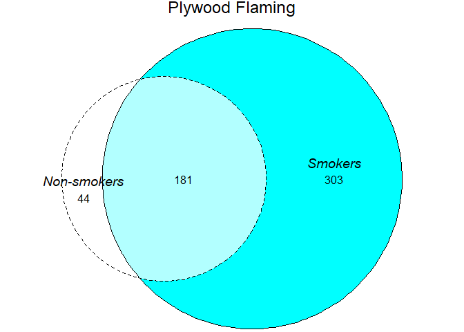
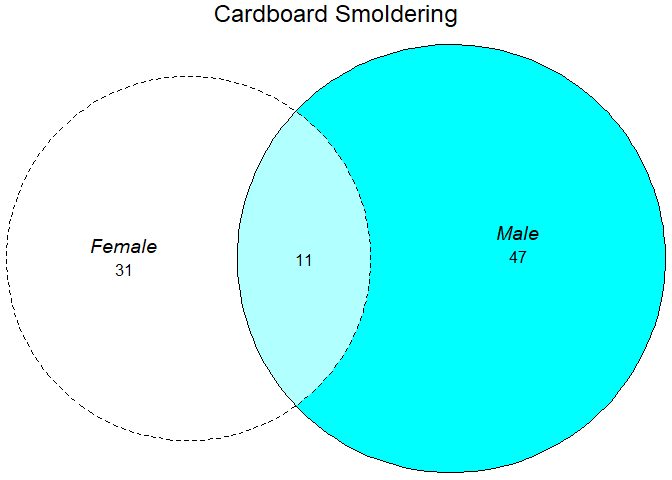
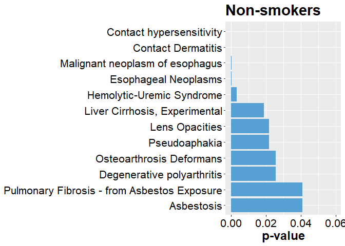
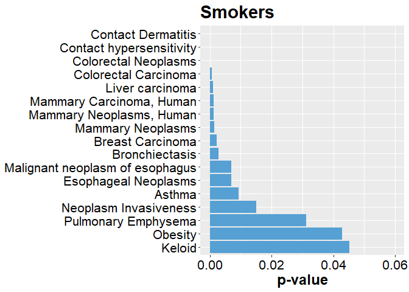
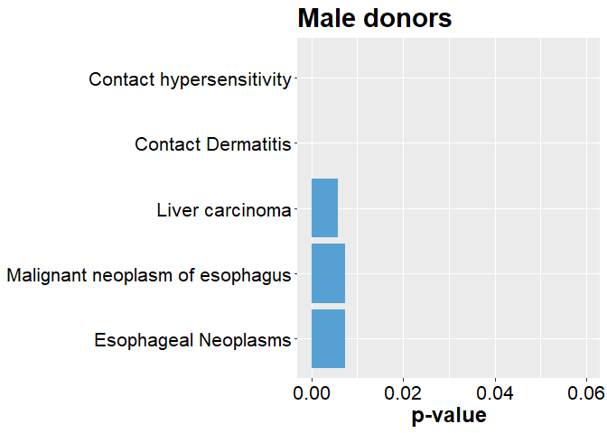

demographic_cohorts_based_analysis
================
Arun Ghosh
2024-09-04

DEMOGRAPHIC COHORTS-DEPENDENT ANALYSIS

``` r
library(limma)
library(edgeR)
library(AnnotationDbi)
library(org.Hs.eg.db)
library(dplyr)
library(stringr)
library(ggplot2)
library(EnhancedVolcano)
library(eulerr)
library(purrr)
library(ggVennDiagram)
library(tidyverse)
library(pheatmap)
library(RColorBrewer) 
organism = "org.Hs.eg.db"
library(organism, character.only = TRUE)
library(clusterProfiler)
library(readxl)
library(psych)
library(corrplot)
library(enrichplot)
library(openxlsx)
library(gprofiler2)

counts <- read.delim("counts_7G.txt", row.names = 1) # reading in RNAseq data

countsN <- counts %>% select(starts_with("N")) # non-smokers
countsS <- counts %>% select(starts_with("S")) # smokers
countsF <- counts %>% select(starts_with("NF") | starts_with("SF")) #  female donors
countsM <- counts %>% select(starts_with("NM") | starts_with("SM")) # male donors

# Set theme
theme_set(theme_bw())
```

Data analysis for each demographic cohort

``` r
###############################################################################
##  Non-smokers ######################################

d0 <- DGEList(countsN)# Create DGEList object
d0 <- calcNormFactors(d0)
cutoff <- 10 # genes expressed in at least 10 samples to be included
drop <- which(apply(cpm(d0), 1, max) < cutoff)
d <- d0[-drop,] 
dim(d) # number of genes left


snames <- colnames(countsN) # Sample names

exposure <- substr(snames, 4, (nchar(snames)-1)) # for exposure groups
exposure <- as.factor(exposure)
exposure
```

``` r
donor <- substr(snames, 1, (nchar(snames)-4)) # for donor based batch correction
batch <- as.factor(donor)
batch
```

``` r
mm5 <- model.matrix(~0+exposure+batch)

y5 <- voom(d, mm5, plot = T)
```

<!-- -->

``` r
colnames(mm5)
```

``` r
fit5 <- lmFit(y5, mm5) # Fitting linear models in limma

head(coef(fit5))
```

``` r
x <- colnames(coef(fit5))
length(x)
x # to see the groups
x <- x[1:7] # selecting levels representing the exposure groups 
# to use in the "for" loop

a5<- list() # list of both coding and non-coding transcripts
b5 <- list() # for storing analyzed data fro significantly altered genes
c5 <- list() # for getting the list of all genes 
d5 <- list() # for storing ENSEMBL transcript names

for(i in 1:length(x)){if(x[i] != "exposureCTR"){
  difference <- paste(x[i],"-","exposureCTR", sep="")
  contr <- makeContrasts(difference, levels = colnames(coef(fit5)))
  tmp <- contrasts.fit(fit5, contr)
  tmp <- eBayes(tmp)
  top.table <- topTable(tmp, sort.by = "P", n = Inf)
  l <- length(which(top.table$adj.P.Val < 0.1 & abs(top.table$logFC) > 0.5))
  exposure <- substr(x[i], nchar(x[i])-2, nchar(x[i]))
  print(paste( "Number of transcripts changed in : ", exposure, l))
  silent=TRUE
  top.table <- as.data.frame(top.table)
  try(top.table$symbol <- mapIds(org.Hs.eg.db, keys = row.names(top.table), 
                                 keytype = "ENSEMBL", column = "SYMBOL", 
                                 multiVals="first")) #adding gene names 
  top.table <- subset(top.table, top.table$symbol != 'NA')
  c5[[i]] <- top.table
  names(c5)[i] <- exposure
  top.table<- top.table %>% 
    mutate(direction = case_when(logFC > 0.5 ~ "up",
                                 logFC < -0.5 ~ "down"))
  top.table <- top.table[(which(top.table$adj.P.Val < 0.1 & 
                                  abs(top.table$logFC) > 0.5)),]
  d5[[i]] = row.names(top.table)
  names(d5)[i] <- exposure
  #rownames(top.table) <- NULL
  rownames(top.table) <- top.table$symbol
  top.table <- top.table[(c(7,1,2,3,4,5,6,8))]
  a5[[i]] = top.table$symbol
  names(a5)[i] <- exposure
  b5[[i]] <- top.table
  names(b5)[i] <- exposure}
}
# removing the empty control group from the lists
a5[3] <- NULL 
b5[3] <- NULL 
c5[3] <- NULL
d5[3] <- NULL
```

``` r
names(a5) <- str_replace_all(names(a5), c(CBF= "Non-smokers\nCardboard\nFlaming",
                                          CBS= "Non-smokers\nCardboard\nSmoldering",
                                          PLF= "Non-smokers\nPlastic\nFlaming",
                                          PLS= "Non-smokers\nPlastic\nSmoldering",
                                          PWF= "Non-smokers\nPlywood\nFlaming",
                                          PWS= "Non-smokers\nPlywood\nSmoldering"))

#---------------------------------------------------#
names(b5) <- str_replace_all(names(b5), c(CBF= "Cardboard Flaming",
                                          CBS= "Cardboard Smoldering",
                                          PLF= "Plastic Flaming",
                                          PLS= "Plastic Smoldering",
                                          PWF= "Plywood Flaming",
                                          PWS= "Plywood Smoldering"))

b5 <- b5 %>% lapply(arrange, direction)

blank_excel <- createWorkbook()

Map(function(df, tab_name){     
  
  addWorksheet(blank_excel, tab_name)
  writeData(blank_excel, tab_name, df)
}, 

b5, names(b5)
)

saveWorkbook(blank_excel, file = "Table S3.xlsx", overwrite = TRUE)
```

``` r
###############################################################################
##  Smokers ######################################

d0 <- DGEList(countsS)# Create DGEList object
d0 <- calcNormFactors(d0)
cutoff <- 10 # genes expressed in at least 10 samples to be included
drop <- which(apply(cpm(d0), 1, max) < cutoff)
d <- d0[-drop,] 
dim(d) # number of genes left


snames <- colnames(countsS) # Sample names

exposure <- substr(snames, 4, (nchar(snames)-1)) # for exposure groups
exposure <- as.factor(exposure)
exposure
```

``` r
donor <- substr(snames, 1, (nchar(snames)-4)) # for donor based batch correction
batch <- as.factor(donor)
batch
```

``` r
mm6 <- model.matrix(~0+exposure+batch)

y6 <- voom(d, mm6, plot = T)
```

<!-- -->

``` r
colnames(mm6)

fit6 <- lmFit(y6, mm6) # Fitting linear models in limma

head(coef(fit6))
```

``` r
x <- colnames(coef(fit6))

x <- x[1:7] # selecting levels representing the exposure groups 
# to use in "for" loop

length(x)

a6 <- list() # list of both coding and non-coding transcripts
b6 <- list() # for storing analyzed data fro significantly altered genes
c6 <- list() # for getting the list of all genes 
d6 <- list() # for storing ENSEMBL transcript names

for(i in 1:length(x)){if(x[i] != "exposureCTR"){
  difference <- paste(x[i],"-","exposureCTR", sep="")
  contr <- makeContrasts(difference, levels = colnames(coef(fit6)))
  tmp <- contrasts.fit(fit6, contr)
  tmp <- eBayes(tmp)
  top.table <- topTable(tmp, sort.by = "P", n = Inf)
  l <- length(which(top.table$adj.P.Val < 0.1 & abs(top.table$logFC) > 0.5))
  exposure <- substr(x[i], nchar(x[i])-2, nchar(x[i]))
  print(paste( "Number of transcripts changed in : ", exposure, l))
  silent=TRUE
  top.table <- as.data.frame(top.table)
  try(top.table$symbol <- mapIds(org.Hs.eg.db, keys = row.names(top.table), 
                                 keytype = "ENSEMBL", column = "SYMBOL", 
                                 multiVals="first")) #adding gene names 
  top.table <- subset(top.table, top.table$symbol != 'NA')
  c6[[i]] <- top.table
  names(c6)[i] <- exposure
  top.table<- top.table %>% 
    mutate(direction = case_when(logFC > 0.5 ~ "up",
                                 logFC < -0.5 ~ "down"))
  top.table <- top.table[(which(top.table$adj.P.Val < 0.1 & 
                                  abs(top.table$logFC) > 0.5)),]
  d6[[i]] = row.names(top.table)
  names(d6)[i] <- exposure
  rownames(top.table) <- NULL
  #rownames(top.table) <- top.table$symbol
  top.table <- top.table[(c(7,1,2,3,4,5,6,8))]
  a6[[i]] = top.table$symbol
  names(a6)[i] <- exposure
  b6[[i]] <- top.table
  names(b6)[i] <- exposure}
}
# removing the empty control group from the lists
a6[3] <- NULL 
b6[3] <- NULL 
c6[3] <- NULL
d6[3] <- NULL


names(a6) <- str_replace_all(names(a6), c(CBF= "Smokers\nCardboard\nFlaming",
                                          CBS= "Smokers\nCardboard\nSmoldering",
                                          PLF= "Smokers\nPlastic\nFlaming",
                                          PLS= "Smokers\nPlastic\nSmoldering",
                                          PWF= "Smokers\nPlywood\nFlaming",
                                          PWS= "Smokers\nPlywood\nSmoldering"))

#---------------------------------------------------#
names(b6) <- str_replace_all(names(b6), c(CBF= "Cardboard Flaming",
                                          CBS= "Cardboard Smoldering",
                                          PLF= "Plastic Flaming",
                                          PLS= "Plastic Smoldering",
                                          PWF= "Plywood Flaming",
                                          PWS= "Plywood Smoldering"))

b6 <- b6 %>% lapply(arrange, direction)

blank_excel <- createWorkbook()

Map(function(df, tab_name){     
  
  addWorksheet(blank_excel, tab_name)
  writeData(blank_excel, tab_name, df)
}, 

b6, names(b6)
)

saveWorkbook(blank_excel, file = "Table S4.xlsx", overwrite = TRUE)
```

``` r
###############################################################################
##  Female ######################################

d0 <- DGEList(countsF)# Create DGEList object
d0 <- calcNormFactors(d0)
cutoff <- 10 # genes expressed in at least 10 samples to be included
drop <- which(apply(cpm(d0), 1, max) < cutoff)
d <- d0[-drop,] 
dim(d) # number of genes left


snames <- colnames(countsF) # Sample names

exposure <- substr(snames, 4, (nchar(snames)-1)) # for exposure groups
exposure <- as.factor(exposure)
exposure
```

``` r
donor <- substr(snames, 1, (nchar(snames)-4)) # for donor based batch correction
batch <- as.factor(donor)
batch
```

``` r
mm7 <- model.matrix(~0+exposure+batch)

y7 <- voom(d, mm7, plot = T)
```

<!-- -->

``` r
colnames(mm7)

fit7 <- lmFit(y7, mm7) # Fitting linear models in limma

head(coef(fit7))
```

``` r
x <- colnames(coef(fit7))
x <- x[1:7] # selecting levels representing the exposure groups 
# to use in "for" loop

length(x)

a7 <- list() # list of both coding and non-coding transcripts
b7 <- list() # for storing analyzed data fro significantly altered genes
c7 <- list() # for getting the list of all genes 
d7 <- list() # for storing ENSEMBL transcript names

for(i in 1:length(x)){if(x[i] != "exposureCTR"){
  difference <- paste(x[i],"-","exposureCTR", sep="")
  contr <- makeContrasts(difference, levels = colnames(coef(fit7)))
  tmp <- contrasts.fit(fit7, contr)
  tmp <- eBayes(tmp)
  top.table <- topTable(tmp, sort.by = "P", n = Inf)
  l <- length(which(top.table$adj.P.Val < 0.1 & abs(top.table$logFC) > 0.5))
  exposure <- substr(x[i], nchar(x[i])-2, nchar(x[i]))
  print(paste( "Number of transcripts changed in : ", exposure, l))
  silent=TRUE
  top.table <- as.data.frame(top.table)
  try(top.table$symbol <- mapIds(org.Hs.eg.db, keys = row.names(top.table), 
                                 keytype = "ENSEMBL", column = "SYMBOL", 
                                 multiVals="first")) #adding gene names 
  top.table <- subset(top.table, top.table$symbol != 'NA')
  c7[[i]] <- top.table
  names(c7)[i] <- exposure
  top.table<- top.table %>% 
    mutate(direction = case_when(logFC > 0.5 ~ "up",
                                 logFC < -0.5 ~ "down"))
  top.table <- top.table[(which(top.table$adj.P.Val < 0.1 & 
                                  abs(top.table$logFC) > 0.5)),]
  d7[[i]] = row.names(top.table)
  names(d7)[i] <- exposure
  rownames(top.table) <- NULL
  #rownames(top.table) <- top.table$symbol
  top.table <- top.table[(c(7,1,2,3,4,5,6,8))]
  a7[[i]] = top.table$symbol
  names(a7)[i] <- exposure
  b7[[i]] <- top.table
  names(b7)[i] <- exposure}
}
# removing the empty control group from the lists
a7[3] <- NULL 
b7[3] <- NULL 
c7[3] <- NULL
d7[3] <- NULL
```

``` r
names(a7) <- str_replace_all(names(a7), c(CBF= "Female\nCardboard\nFlaming",
                                          CBS= "Female\nCardboard\nSmoldering",
                                          PLF= "Female\nPlastic\nFlaming",
                                          PLS= "Female\nPlastic\nSmoldering",
                                          PWF= "Female\nPlywood\nFlaming",
                                          PWS= "Female\nPlywood\nSmoldering"))

#---------------------------------------------------#
names(b7) <- str_replace_all(names(b7), c(CBF= "Cardboard Flaming",
                                          CBS= "Cardboard Smoldering",
                                          PLF= "Plastic Flaming",
                                          PLS= "Plastic Smoldering",
                                          PWF= "Plywood Flaming",
                                          PWS= "Plywood Smoldering"))
b7 <- b7 %>% lapply(arrange, direction)

blank_excel <- createWorkbook()

Map(function(df, tab_name){     
  
  addWorksheet(blank_excel, tab_name)
  writeData(blank_excel, tab_name, df)
}, 

b7, names(b7)
)

saveWorkbook(blank_excel, file = "Table S5.xlsx", overwrite = TRUE)
```

``` r
###############################################################################
##  Male ######################################

d0 <- DGEList(countsM)# Create DGEList object
d0 <- calcNormFactors(d0)
cutoff <- 10 # genes expressed in at least 10 samples to be included
drop <- which(apply(cpm(d0), 1, max) < cutoff)
d <- d0[-drop,] 
dim(d) # number of genes left


snames <- colnames(countsM) # Sample names

exposure <- substr(snames, 4, (nchar(snames)-1)) # for exposure groups
exposure <- as.factor(exposure)
exposure
```

``` r
donor <- substr(snames, 1, (nchar(snames)-4)) # for donor based batch correction
batch <- as.factor(donor)
batch
```

``` r
mm8 <- model.matrix(~0+exposure+batch)

y8 <- voom(d, mm8, plot = T)
```

<!-- -->

``` r
colnames(mm8)

fit8 <- lmFit(y8, mm8) # Fitting linear models in limma

head(coef(fit8))
```

``` r
x <- colnames(coef(fit8))
x <- x[1:7] # selecting levels representing the exposure groups 
# to use in "for" loop

a8 <- list() # list of both coding and non-coding transcripts
b8 <- list() # for storing analyzed data fro significantly altered genes
c8 <- list() # for getting the list of all genes 
d8 <- list() # for storing ENSEMBL transcript names

for(i in 1:length(x)){if(x[i] != "exposureCTR"){
  difference <- paste(x[i],"-","exposureCTR", sep="")
  contr <- makeContrasts(difference, levels = colnames(coef(fit8)))
  tmp <- contrasts.fit(fit8, contr)
  tmp <- eBayes(tmp)
  top.table <- topTable(tmp, sort.by = "P", n = Inf)
  l <- length(which(top.table$adj.P.Val < 0.1 & abs(top.table$logFC) > 0.5))
  exposure <- substr(x[i], nchar(x[i])-2, nchar(x[i]))
  print(paste( "Number of transcripts changed in : ", exposure, l))
  silent=TRUE
  top.table <- as.data.frame(top.table)
  try(top.table$symbol <- mapIds(org.Hs.eg.db, keys = row.names(top.table), 
                                 keytype = "ENSEMBL", column = "SYMBOL", 
                                 multiVals="first")) #adding gene names 
  top.table <- subset(top.table, top.table$symbol != 'NA')
  c8[[i]] <- top.table
  names(c8)[i] <- exposure
  top.table<- top.table %>% 
    mutate(direction = case_when(logFC > 0.5 ~ "up",
                                 logFC < -0.5 ~ "down"))
  top.table <- top.table[(which(top.table$adj.P.Val < 0.1 & 
                                  abs(top.table$logFC) > 0.5)),]
  d8[[i]] = row.names(top.table)
  names(d8)[i] <- exposure
  rownames(top.table) <- NULL
  #rownames(top.table) <- top.table$symbol
  top.table <- top.table[(c(7,1,2,3,4,5,6,8))]
  a8[[i]] = top.table$symbol
  names(a8)[i] <- exposure
  b8[[i]] <- top.table
  names(b8)[i] <- exposure}
}
# removing the empty control group from the lists
a8[3] <- NULL 
b8[3] <- NULL 
c8[3] <- NULL
d8[3] <- NULL
```

``` r
names(a8) <- str_replace_all(names(a8), c(CBF= "Male\nCardboard\nFlaming",
                                          CBS= "Male\nCardboard\nSmoldering",
                                          PLF= "Male\nPlastic\nFlaming",
                                          PLS= "Male\nPlastic\nSmoldering",
                                          PWF= "Male\nPlywood\nFlaming",
                                          PWS= "Male\nPlywood\nSmoldering"))

#---------------------------------------------------#
names(b8) <- str_replace_all(names(b8), c(CBF= "Cardboard Flaming",
                                          CBS= "Cardboard Smoldering",
                                          PLF= "Plastic Flaming",
                                          PLS= "Plastic Smoldering",
                                          PWF= "Plywood Flaming",
                                          PWS= "Plywood Smoldering"))

b8 <- b8 %>% lapply(arrange, direction)

blank_excel <- createWorkbook()

Map(function(df, tab_name){     
  
  addWorksheet(blank_excel, tab_name)
  writeData(blank_excel, tab_name, df)
}, 

b8, names(b8)
)

saveWorkbook(blank_excel, file = "Table S6.xlsx", overwrite = TRUE)
```

Figure 6

``` r
###########################################################

NvS <- c(a5, a6) # non-smoker and smoker donors

NvS_CBf <- NvS[c(1,7)]
names(NvS_CBf) <- sub('\nCardboard\nFlaming','', names(NvS_CBf))

EP_All_CB <- euler(NvS_CBf, shape = "ellipse") # Euler plot 
plot(EP_All_CB,
     quantities = TRUE,
     lty = 2:1, #cex=3,
     main = "Cardboard Flaming",
     labels = list(font = 3, cex = 1.2), 
     fills = c("white","cyan" ))
```

<!-- -->

``` r
NvS_PWf <- NvS[c(5,11)]
names(NvS_PWf) <- sub('\nPlywood\nFlaming','', names(NvS_PWf))

EP_All_PW <- euler(NvS_PWf, shape = "ellipse") # Euler plot 
plot(EP_All_PW,
     quantities = TRUE,
     lty = 2:1, #cex=3,
     main = "Plywood Flaming",
     labels = list(font = 3, cex = 1.2), 
     fills = c("white","cyan" ))
```

<!-- -->

``` r
NvS_PLf <- NvS[c(3,9)]
names(NvS_PLf) <- sub('\nPlastic\nFlaming','', names(NvS_PLf))

EP_All_PL <- euler(NvS_PLf, shape = "ellipse") # Euler plot 
plot(EP_All_PL,
     quantities = TRUE,
     lty = 2:1, #cex=3,
     main = "Plastic Flaming",
     labels = list(font = 3, cex = 1.2), 
     fills = c("white","cyan" ))
```

<!-- -->

``` r
#---------------------------------------------------------------#

FvM <- c(a7, a8) # female and male donors

FvM_CBf <- FvM[c(1,7)]
names(FvM_CBf) <- sub('\nCardboard\nFlaming','', names(FvM_CBf))

EP_All_CB <- euler(FvM_CBf, shape = "ellipse") # Euler plot 
plot(EP_All_CB,
     quantities = TRUE,
     lty = 1:2, #cex=3,
     main = "Cardboard Flaming",
     labels = list(font = 3, cex = 1.2), 
     fills = c("cyan","white"))
```

<!-- -->

``` r
FvM_PWf <- FvM[c(5,11)]
names(FvM_PWf) <- sub('\nPlywood\nFlaming','', names(FvM_PWf))

EP_All_PW <- euler(FvM_PWf, shape = "ellipse") # Euler plot 
plot(EP_All_PW,
     quantities = TRUE,
     lty = 1:2, #cex=3,
     main = "Plywood Flaming",
     labels = list(font = 3, cex = 1.2), 
     fills = c("cyan","white"))
```

<!-- -->

``` r
FvM_PLf <- FvM[c(3,9)]
names(FvM_PLf) <- sub('\nPlastic\nFlaming','', names(FvM_PLf))

EP_All_PL <- euler(FvM_PLf, shape = "ellipse") # Euler plot 
plot(EP_All_PL,
     quantities = TRUE,
     lty = 1:2, #cex=3,
     main = "Plastic Flaming",
     labels = list(font = 3, cex = 1.2), 
     fills = c("cyan","white"))
```

<!-- -->

Figure E7

``` r
#----------------------------------------------------------------#

NvS_CBs <- NvS[c(2,8)]
names(NvS_CBs) <- sub('\nCardboard\nSmoldering','', names(NvS_CBs))

EP_All_CBs <- euler(NvS_CBs, shape = "ellipse") # Euler plot 
plot(EP_All_CBs,
     quantities = TRUE,
     lty = 2:1, #cex=3,
     main = "Cardboard Smoldering",
     labels = list(font = 3, cex = 1.2), 
     fills = c("white","cyan" ))
```

<!-- -->

``` r
NvS_PWs <- NvS[c(6,12)]
names(NvS_PWs) <- sub('\nPlywood\nSmoldering','', names(NvS_PWs))

EP_All_PWs <- euler(NvS_PWs, shape = "ellipse") # Euler plot 
plot(EP_All_PWs,
     quantities = TRUE,
     lty = 1:2, #cex=3,
     main = "Plywood Smoldering",
     labels = list(font = 3, cex = 1.2), 
     fills = c("cyan","white" ))
```

<!-- -->

``` r
NvS_PLs <- NvS[c(4,10)]
names(NvS_PLs) <- sub('\nPlastic\nSmoldering','', names(NvS_PLs))

EP_All_PLs <- euler(NvS_PLs, shape = "ellipse") # Euler plot 
plot(EP_All_PLs,
     quantities = TRUE,
     lty = 1:2, #cex=3,
     main = "Plastic Smoldering",
     labels = list(font = 3, cex = 1.2), 
     fills = c("cyan","white"))
```

<!-- -->

``` r
FvM_CBs <- FvM[c(2,8)]
names(FvM_CBs) <- sub('\nCardboard\nSmoldering','', names(FvM_CBs))

EP_All_CBs <- euler(FvM_CBs, shape = "ellipse") # Euler plot 
plot(EP_All_CBs,
     quantities = TRUE,
     lty = 2:1, #cex=3,
     main = "Cardboard Smoldering",
     labels = list(font = 3, cex = 1.2), 
     fills = c("white","cyan" ))
```

<!-- -->

``` r
FvM_PWs <- FvM[c(6,12)]
names(FvM_PWs) <- sub('\nPlywood\nSmoldering','', names(FvM_PWs))

EP_All_PWs <- euler(FvM_PWs, shape = "ellipse") # Euler plot 
plot(EP_All_PWs,
     quantities = TRUE,
     #lty = 1:2, #cex=3,
     main = "Plywood Smoldering",
     labels = list(font = 3, cex = 1.2), 
     fills = c("cyan","white" ))
```

<!-- -->

``` r
FvM_PLs <- FvM[c(4,10)]
names(FvM_PLs) <- sub('\nPlastic\nSmoldering','', names(FvM_PLs))

EP_All_PLs <- euler(FvM_PLs, shape = "ellipse") # Euler plot 
plot(EP_All_PLs,
     quantities = TRUE,
     lty = 2:1, #cex=3,
     main = "Plastic Smoldering",
     labels = list(font = 3, cex = 1.2), 
     fills = c("white","cyan" ))
```

<!-- -->

Figure S8

``` r
# download the GMT file from DisGeNET
# gmturl = file.path("http://www.disgenet.org",
#                    "static/disgenet_ap1/files/downloads/gmt_files",
#                    "disgenet.curated.v7.symbols.gmt")
# download.file(url = gmturl, destfile = "DisGeNET.gmt")

# #downloaded on June 13 2024
# #--------------------------#

token = upload_GMT_file(gmtfile = "DisGeNET.gmt")
```

``` r
#####################################################################
DG <- list()

#------------------------------------------------------------------#
PWf_N <- gconvert(d5$PWF, organism="hsapiens") # non-smoker donors

PWf_N = gost(PWf_N$name, 
             organism = token, 
             ordered_query = TRUE)

DG$PWf_N <- PWf_N$result

df <- as.data.frame(DG$PWf_N[, c("term_name", "p_value")] )
df <- df %>% mutate(term_name = str_sub(term_name, start = 10L)) %>%
  mutate(term_name = str_replace_all(term_name, "_", " "))
df <- df[order(df$p_value, decreasing = TRUE), ]
df$term_name <- factor(df$term_name, levels = df$term_name)
q1 <-ggplot(df, aes(x=p_value, y=term_name)) +
  geom_col(fill = "#56a0d3") +
  ggtitle("Non-smokers") + xlab("p-value")+
  theme(axis.text.x = element_text(color = "black", size = 16), 
        axis.text.y = element_text(color = "black", size = 16),
        title = element_text(size = 18, face="bold"),
        # axis.title.x = element_blank(),
        axis.title.y = element_blank())+ xlim(0.000, 0.06)
q1 
```

<!-- -->

``` r
#------------------------------------------------------------------#
PWf_S <- gconvert(d6$PWF, organism="hsapiens") # smoker donors

PWf_S = gost(PWf_S$name, 
             organism = token, 
             ordered_query = TRUE)

DG$PWf_S <- PWf_S$result

df <- as.data.frame(DG$PWf_S[, c("term_name", "p_value")] )
df <- df %>% mutate(term_name = str_sub(term_name, start = 10L)) %>%
  mutate(term_name = str_replace_all(term_name, "_", " "))
df <- df[order(df$p_value, decreasing = TRUE), ]
df$term_name <- factor(df$term_name, levels = df$term_name)
q2 <-ggplot(df, aes(x=p_value, y=term_name)) +
  geom_col(fill = "#56a0d3") +
  ggtitle("Smokers")+  xlab("p-value")+
  theme(axis.text.x = element_text(color = "black", size = 16), 
        axis.text.y = element_text(color = "black", size = 16),
        title = element_text(size = 18, face="bold"),
        #axis.title.x = element_blank(),
        axis.title.y = element_blank())+ xlim(0.000, 0.06)
q2 
```

<!-- -->

``` r
#------------------------------------------------------------------#
PWf_F <- gconvert(d7$PWF, organism="hsapiens") # female donors


PWf_F = gost(PWf_F$name, 
             organism = token, 
             ordered_query = TRUE)
DG$PWf_F <- PWf_F$result

df <- as.data.frame(DG$PWf_F[, c("term_name", "p_value")] )
df <- df %>% mutate(term_name = str_sub(term_name, start = 10L)) %>%
  mutate(term_name = str_replace_all(term_name, "_", " "))
df <- df[order(df$p_value, decreasing = TRUE), ]
df$term_name <- factor(df$term_name, levels = df$term_name)
q3 <-ggplot(df, aes(x=p_value, y=term_name)) +
  geom_col(fill = "#56a0d3") +
  ggtitle("Female donors")+ xlab("p-value")+
  theme(axis.text.x = element_text(color = "black", size = 16), 
        axis.text.y = element_text(color = "black", size = 16),
        title = element_text(size = 18, face="bold"),
        # axis.title.x = element_blank(),
        axis.title.y = element_blank())+ xlim(0.000, 0.06)
q3 
```

<!-- -->

``` r
#------------------------------------------------------------------#
PWf_M <- gconvert(d8$PWF, organism="hsapiens") # male donors

PWf_M = gost(PWf_M$name, 
             organism = token, 
             ordered_query = TRUE)

DG$PWf_M <- PWf_M$result

df <- as.data.frame(DG$PWf_M[, c("term_name", "p_value")] )
df <- df %>% mutate(term_name = str_sub(term_name, start = 10L)) %>%
  mutate(term_name = str_replace_all(term_name, "_", " "))
df <- df[order(df$p_value, decreasing = TRUE), ]
df$term_name <- factor(df$term_name, levels = df$term_name)
q4<-ggplot(df, aes(x=p_value, y=term_name)) +
  geom_col(fill = "#56a0d3") +
  ggtitle("Male donors") + xlab("p-value")+
  theme(axis.text.x = element_text(color = "black", size = 16), 
        axis.text.y = element_text(color = "black", size = 16),
        title = element_text(size = 18, face="bold"),
        # axis.title.x = element_blank(),
        axis.title.y = element_blank())+ xlim(0.000, 0.06)

q4
```

<!-- -->

``` r
#---------------------------------------------------#

names(DG) <- str_replace_all(names(DG), c(PWf_N= "Non-smokers",
                                          PWf_S= "Smokers",
                                          PWf_F= "Female",
                                          PWf_M= "Male"))

blank_excel <- createWorkbook()

Map(function(df, tab_name){     
  
  addWorksheet(blank_excel, tab_name)
  writeData(blank_excel, tab_name, df)
}, 

DG, names(DG)
)

saveWorkbook(blank_excel, file = "Table S7.xlsx", overwrite = TRUE)
```
