bulk-RNAseq
================
Arun Ghosh
2024-05-20

``` r
# -loading packages and data

library(edgeR)
library(AnnotationDbi)
library(org.Hs.eg.db)
library(dplyr)
library(stringr)
library(ggplot2)
library(EnhancedVolcano)
library(eulerr)
library(purrr)
library(ggVennDiagram)
library(tidyverse)
library(pheatmap)
library(RColorBrewer) 
organism = "org.Hs.eg.db"
library(organism, character.only = TRUE)
library(clusterProfiler)
library(readxl)
library(psych)
library(corrplot)
library(enrichplot)
library(openxlsx)

counts <- read.delim("counts_7G.txt", row.names = 1) # reading in RNAseq data

# output_format = 'all'
```

``` r
##  Donor effect correction and analysis #########
##  Overall comparison ########################

d0 <- DGEList(counts)# Create DGEList object
d0 <- calcNormFactors(d0)
cutoff <- 10 # genes expressed in at least 10 samples to be included
drop <- which(apply(cpm(d0), 1, max) < cutoff)
d <- d0[-drop,] 
dim(d) # number of genes left

snames <- colnames(counts) # Sample names

exposure <- substr(snames, 4, (nchar(snames)-1)) # for exposure groups
exposure <- as.factor(exposure)
exposure
```

``` r
donor <- substr(snames, 1, (nchar(snames)-4)) # for donor based batch correction
batch <- as.factor(donor)
batch
```

``` r
mm4 <- model.matrix(~0+exposure+batch)
 
y4 <- voom(d, mm4, plot = T)
```

<!-- -->

``` r
colnames(mm4)
```

``` r
fit4 <- lmFit(y4, mm4) # Fitting linear models in limma

head(coef(fit4))
```

``` r
x <- colnames(coef(fit4))
length(x)

x # to see the groups
x <- x[1:7] # selecting levels representing the exposure groups 
            # to use in the "for" loop

a4 <- list() # list of both coding and non-coding transcripts
b4 <- list() # for storing analyzed data fro significantly altered genes
c4 <- list() # for getting the list of all genes 
d4 <- list() # for storing ENSEMBL transcript names

for(i in 1:length(x)){if(x[i] != "exposureCTR"){
  difference <- paste(x[i],"-","exposureCTR", sep="")
  contr <- makeContrasts(difference, levels = colnames(coef(fit4)))
  tmp <- contrasts.fit(fit4, contr)
  tmp <- eBayes(tmp)
  top.table <- topTable(tmp, sort.by = "P", n = Inf)
  l <- length(which(top.table$adj.P.Val <= 0.1 & abs(top.table$logFC) >= 0.5))
  exposure <- substr(x[i], nchar(x[i])-2, nchar(x[i]))
  print(paste( "Number of transcripts changed in : ", exposure, l))
  silent=TRUE
  top.table <- as.data.frame(top.table)
  try(top.table$symbol <- mapIds(org.Hs.eg.db, keys = row.names(top.table), 
                             keytype = "ENSEMBL", column = "SYMBOL", 
                             multiVals="first")) #adding gene names 
  top.table <- subset(top.table, top.table$symbol != 'NA')
  c4[[i]] <- top.table
  names(c4)[i] <- exposure
  top.table<- top.table %>% 
    mutate(direction = case_when(logFC > 0.5 ~ "up",
                                 logFC < -0.5 ~ "down"))
  top.table <- top.table[(which(top.table$adj.P.Val < 0.1 & 
                                  abs(top.table$logFC) > 0.5)),]
  d4[[i]] = row.names(top.table)
  names(d4)[i] <- exposure
  rownames(top.table) <- NULL
  #rownames(top.table) <- top.table$symbol
  top.table <- top.table [(c(7,1,2,3,4,5,6,8))]
  a4[[i]] = top.table$symbol
  names(a4)[i] <- exposure
  b4[[i]] <- top.table
  names(b4)[i] <- exposure}
  }

# removing the empty control group from the lists
a4[3] <- NULL 
b4[3] <- NULL 
c4[3] <- NULL
d4[3] <- NULL
```

FIGURE 1

``` r
#printing volcano plot
res.df <- as.data.frame(c4[1]) # Cardboard Flaming
colnames(res.df) <- substr(colnames(res.df), 5, (nchar(colnames(res.df))))

EnhancedVolcano(res.df,
                lab = res.df$symbol,
                x = 'logFC',
                y = 'adj.P.Val',
                title = 'Cardboard Flaming',
                xlim = c(-2.0, 4.0),
                ylim = c(0, -log10(10e-12)),
                pCutoff = 10e-2,
                pCutoffCol = 'adj.P.Val',
                FCcutoff = 0.5,
                boxedLabels = TRUE,
                parseLabels = TRUE,
                selectLab = c('CILP', 'EDN2', 'CXCL5', 'VNN2', 'MAB21L3',
                              'CYP1A1', 'MT1A', 'MT1G', 'CYP1B1', 'MT1M'),
                col = c('black', 'black', 'black', 'red3'),
                pointSize = 3.0,
                labSize = 5.0,
                colAlpha = 1,
                legendPosition = 'none',
                legendLabSize = 12,
                legendIconSize = 5.0,
                drawConnectors = TRUE,
                widthConnectors = 1.0,
                colConnectors = 'black')
```

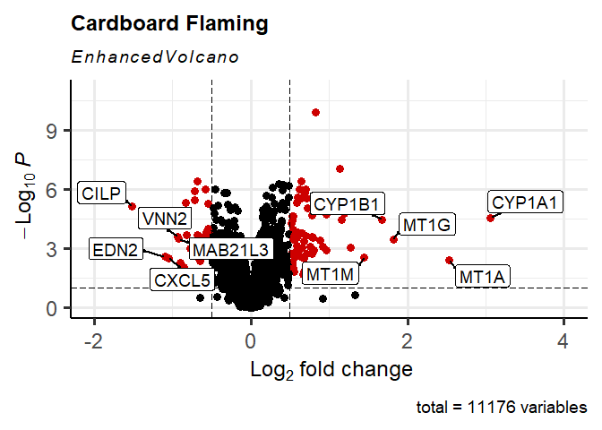<!-- -->

``` r
#printing volcano plot
res.df <- as.data.frame(c4[2]) # Cardboard Smoldering
colnames(res.df) <- substr(colnames(res.df), 5, (nchar(colnames(res.df))))

EnhancedVolcano(res.df,
                lab = res.df$symbol,
                x = 'logFC',
                y = 'adj.P.Val',
                title = 'Cardboard Smoldering',
                xlim = c(-2.0, 4.0),
                ylim = c(0, -log10(10e-12)),
                pCutoff = 10e-2,
                pCutoffCol = 'adj.P.Val',
                FCcutoff = 0.5,
                boxedLabels = TRUE,
                parseLabels = TRUE,
                selectLab = c('CILP', 'TYMS', 'UBD', 'CYP2A13', 'FN1',
                              'OLFM4', 'SFTPB', 'UCHL1', 'CRCT1', 'AKR1B10'),
                col = c('black', 'black', 'black', 'red3'),
                pointSize = 3.0,
                labSize = 5.0,
                colAlpha = 1,
                legendPosition = 'none',
                legendLabSize = 12,
                legendIconSize = 5.0,
                drawConnectors = TRUE,
                widthConnectors = 1.0,
                colConnectors = 'black')
```

<!-- -->

``` r
#printing volcano plot
res.df <- as.data.frame(c4[5]) # Plywood Flaming
colnames(res.df) <- substr(colnames(res.df), 5, (nchar(colnames(res.df))))

EnhancedVolcano(res.df,
                lab = res.df$symbol,
                x = 'logFC',
                y = 'adj.P.Val',
                title = 'Plywood Flaming',
                xlim = c(-2.0, 4.0),
                ylim = c(0, -log10(10e-20)),
                pCutoff = 10e-2,
                pCutoffCol = 'adj.P.Val',
                FCcutoff = 0.5,
                boxedLabels = TRUE,
                parseLabels = TRUE,
                selectLab = c('PTPRT', 'CILP', 'EDN2',  'ANPEP', 'SEC14L3', 
                              'CYP1A1', 'UCHL1', 'CYP1B1',  'AKR1B10', 'CYP1B1-AS1'),
                col = c('black', 'black', 'black', 'red3'),
                pointSize = 3.0,
                labSize = 5.0,
                colAlpha = 1,
                legendPosition = 'none',
                legendLabSize = 12,
                legendIconSize = 5.0,
                drawConnectors = TRUE,
                widthConnectors = 1.0,
                colConnectors = 'black')
```

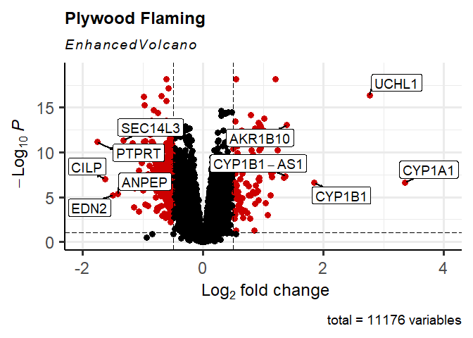<!-- -->

``` r
#printing volcano plot
res.df <- as.data.frame(c4[6]) # Plywood Smoldering
colnames(res.df) <- substr(colnames(res.df), 5, (nchar(colnames(res.df))))

EnhancedVolcano(res.df,
                lab = res.df$symbol,
                x = 'logFC',
                y = 'adj.P.Val',
                title = 'Plywood Smoldering',
                xlim = c(-2.0, 4.0),
                ylim = c(0, -log10(10e-20)),
                pCutoff = 10e-2,
                pCutoffCol = 'adj.P.Val',
                FCcutoff = 0.5,
                boxedLabels = TRUE,
                parseLabels = TRUE,
                selectLab = c('STC2', 'CHAC1', 'CILP', 'DUSP2', 'UCHL1', 
                              'MUC5AC', 'HSPA6'),
                col = c('black', 'black', 'black', 'red3'),
                pointSize = 3.0,
                labSize = 5.0,
                colAlpha = 1,
                legendPosition = 'none',
                legendLabSize = 12,
                legendIconSize = 5.0,
                drawConnectors = TRUE,
                widthConnectors = 1.0,
                colConnectors = 'black')
```

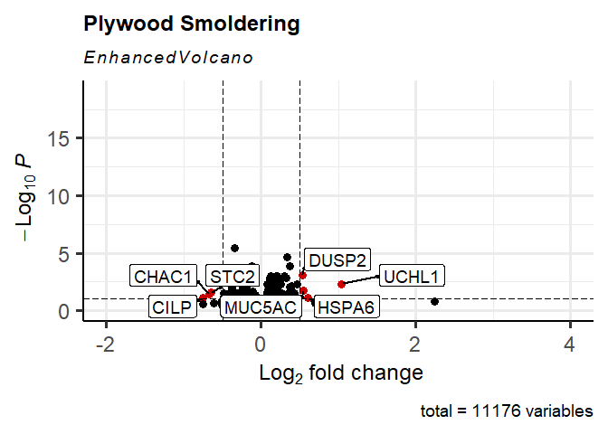<!-- -->

``` r
#printing volcano plot
res.df <- as.data.frame(c4[3]) # Plastic Flaming
colnames(res.df) <- substr(colnames(res.df), 5, (nchar(colnames(res.df))))

EnhancedVolcano(res.df,
                lab = res.df$symbol,
                x = 'logFC',
                y = 'adj.P.Val',
                title = 'Plastic Flaming',
                xlim = c(-2.0, 4.0),
                ylim = c(0, -log10(10e-12)),
                pCutoff = 10e-2,
                pCutoffCol = 'adj.P.Val',
                FCcutoff = 0.5,
                boxedLabels = TRUE,
                parseLabels = TRUE,
                selectLab = c('CILP', 'EDN2', 'MAB21L3', 'ANPEP', 'PPP1R3C', 
                              'CYP1A1', 'CYP1B1', 'IL6', 'CSF3', 'IL19'),
                col = c('black', 'black', 'black', 'red3'),
                pointSize = 3.0,
                labSize = 5.0,
                colAlpha = 1,
                legendPosition = 'none',
                legendLabSize = 12,
                legendIconSize = 5.0,
                drawConnectors = TRUE,
                widthConnectors = 1.0,
                colConnectors = 'black')
```

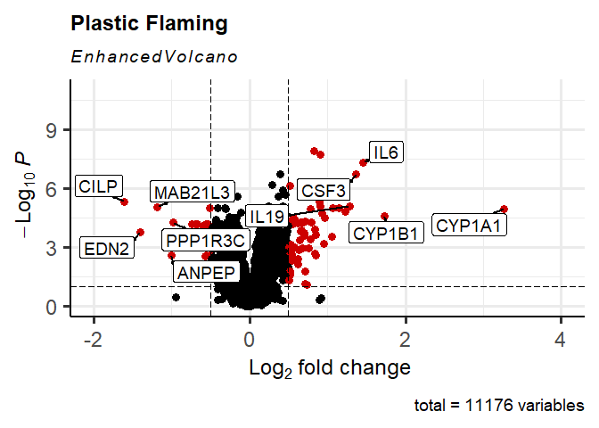<!-- -->

``` r
#printing volcano plot
res.df <- as.data.frame(c4[4]) # Plastic Smoldering
colnames(res.df) <- substr(colnames(res.df), 5, (nchar(colnames(res.df))))

EnhancedVolcano(res.df,
                lab = res.df$symbol,
                x = 'logFC',
                y = 'adj.P.Val',
                title = 'Plastic Smoldering',
                xlim = c(-2.0, 4.0),
                ylim = c(0, -log10(10e-12)),
                pCutoff = 10e-2,
                pCutoffCol = 'adj.P.Val',
                FCcutoff = 0.5,
                boxedLabels = TRUE,
                parseLabels = TRUE,
                selectLab = c( 'H19', 'F2RL3', 'CLDN10', 'CXCL14', 'C5AR2',  
                              'KILH', 'KLK6', 'IL6', 'UCHL1', 'OLFM4'),
                col = c('black', 'black', 'black', 'red3'),
                pointSize = 3.0,
                labSize = 5.0,
                colAlpha = 1,
                legendPosition = 'none',
                legendLabSize = 12,
                legendIconSize = 5.0,
                drawConnectors = TRUE,
                widthConnectors = 1.0,
                colConnectors = 'black')
```

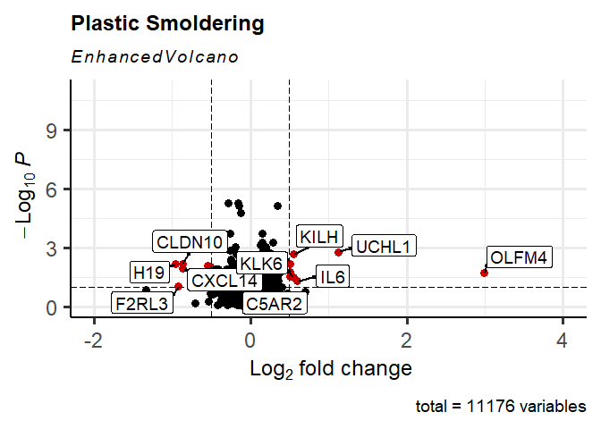<!-- -->

``` r
names(a4) <- str_replace_all(names(a4), c(CBF= "Cardboard\nFlaming",
                                          CBS= "Cardboard\nSmoldering",
                                          PLF= "Plastic\nFlaming",
                                          PLS= "Plastic\nSmoldering",
                                          PWF= "Plywood\nFlaming",
                                          PWS= "Plywood\nSmoldering"))

a4CB <- a4 %>% 
  keep(str_detect(names(a4), "Cardboard"))
names(a4CB) <- sub('Cardboard\n','', names(a4CB))

EP_All_CB <- euler(a4CB, shape = "ellipse") # Euler plot 

plot(EP_All_CB,
     quantities = TRUE, cex = 5,
     main = "Cardboard",
     lty = 1:3,
     labels = list(font = 3, cex = 1.5),
     fills = c("cyan", "white"))
```

<!-- -->

``` r
a4PW <- a4 %>% 
  keep(str_detect(names(a4), "Plywood"))
names(a4PW) <- sub('Plywood\n','', names(a4PW))

EP_All_PW <- euler(a4PW, shape = "ellipse") # Euler plot 

plot(EP_All_PW,
  quantities = TRUE, cex = 5,
  main = "Plywood",
  lty = 1:3,
  labels = list(font = 3, cex = 1.5),
  fills = c("cyan", "white"))
```

<!-- -->

``` r
a4PL <- a4 %>% 
  keep(str_detect(names(a4), "Plastic"))
names(a4PL) <- sub('Plastic\n','', names(a4PL))

EP_All_PL <- euler(a4PL, shape = "ellipse") # Euler plot 

plot(EP_All_PL,
     quantities = TRUE, cex = 5,
     main = "Plastic",
     lty = 1:3,
     labels = list(font = 3, cex = 1.5),
     fills = c("cyan", "white"))
```

<!-- -->

FIGURE 2

``` r
a4F <- a4 %>% 
  keep(str_detect(names(a4), "Flaming"))
names(a4F) <- sub('\nFlaming','', names(a4F))

EP_All_F <- euler(a4F, shape = "ellipse") # Euler plot -flaming
plot(EP_All_F, quantities = TRUE, cex = 5, labels = list(font = 3, cex = 1.5))
```

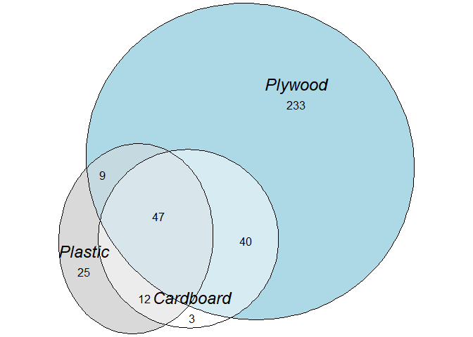<!-- -->

``` r
names(d4) <- str_replace_all(names(d4), c(CBF= "Cardboard Flaming",
                                          CBS= "Cardboard Smoldering",
                                          PLF= "Plastic Flaming",
                                          PLS= "Plastic Smoldering",
                                          PWF= "Plywood Flaming",
                                          PWS= "Plywood Smoldering"))

d4F <- d4 %>% 
  keep(str_detect(names(d4), "Flaming"))
names(d4F) <- sub('\nFlaming','', names(d4F))

z <- process_region_data(Venn(d4F))
z <- as.data.frame(z)

counts_Fg <- counts %>% select(ends_with("CTRL") | 
                               ends_with("CBFh") | 
                               ends_with("PLFh") | 
                               ends_with("PwFh")) # selecting flaming samples

#-----------------------------------------------------------------------#
# Control and flaming

counts_Fg_c <- subset(counts_Fg, rownames(counts_Fg) %in% c(unlist(z[7,3])))

counts_Fg_c <- counts_Fg_c %>% rownames_to_column(var = "transcripts")

counts_Fg_c <- counts_Fg_c %>% pivot_longer(cols = -1, names_to = "SampleID", values_to = "count") 
counts_Fg_c$SampleID <- substr(counts_Fg_c$SampleID, 4, nchar(counts_Fg_c$SampleID))

counts_Fg_c$SampleID <- str_replace_all(counts_Fg_c$SampleID, c(CBFh = "Cardboard",
                                                                PLFh = "Plastic",
                                                                PWFh = "Plywood",
                                                                CTRL = "Control"))

colnames(counts_Fg_c)

counts_ALL <- counts_Fg_c %>%
  group_by(transcripts, SampleID) %>%
  summarise(across(everything(), sum))

counts_ALL <- counts_ALL %>% pivot_wider(names_from = "SampleID", values_from = "count") %>%
  column_to_rownames(var = "transcripts")

counts_ALL <- counts_ALL %>% relocate("Control", "Cardboard", "Plywood", "Plastic" )
counts_ALL$gene <- mapIds(org.Hs.eg.db, keys = row.names(counts_ALL), 
                         keytype = "ENSEMBL", column = "SYMBOL", 
                         multiVals="first") #adding gene names 
counts_ALL <- subset(counts_ALL, counts_ALL$gene != 'NA')
rownames(counts_ALL) <- NULL
rownames(counts_ALL) <- counts_ALL$gene
counts_ALL <- counts_ALL[,1:(ncol(counts_ALL)-1)]

temp3 <- as.matrix(counts_ALL)
pheatmap(temp3, 
         color = colorRampPalette(rev(brewer.pal(n = 7, name ="RdYlBu")))(100), 
         # sets color scheme
         display_numbers = FALSE,
         number_color = "black",
         fontsize_number = 5,
         main = "Flaming",
         angle_col = c("45"), # makes column labels horizontal
         cellwidth = 10, # sets dimensions of cells 
         cellheight = 7, # sets dimensions of cells 
         border_color = "black", # adds black border around cells
         treeheight_col = 5, # sets dims of trees 
         fontsize_row = 7, # sets dims of trees 
         scale = 'row', # scales data by row
         fontsize_col = 8, # sets font size for column labels
         cutree_rows = 2, # indicates how many clusters to show 
         cluster_cols = FALSE, 
         cluster_rows = TRUE)
```

<!-- -->

``` r
##########################################################################
# GSEA and GO analyses
##########################################################################

OverL <- process_region_data(Venn(d4F)) #collecting intersect values

OverL$item[7] # viewing 47 transcripts commonly affected by all flaming condensates

#---------------------------------------------#

#GO over-representation analysis
geneOL <- unlist(OverL$item[7])
enGOOL <- enrichGO(gene         = geneOL,
                   OrgDb         = org.Hs.eg.db,
                   keyType       = 'ENSEMBL',
                   ont           = "ALL",
                   pAdjustMethod = "BH",
                   pvalueCutoff  = 0.05,
                   qvalueCutoff  = 0.1)
head(enGOOL)

#barplot
barplot(enGOOL, showCategory=10, font = 18, title = "47 -common genes")+ 
  scale_x_continuous(breaks = seq(0, 10, by = 2), limits=c(0,10))+
  theme(axis.text.y = element_text(lineheight = 0.7, size = 15),
        title = element_text(size = 15, face="bold"))
```

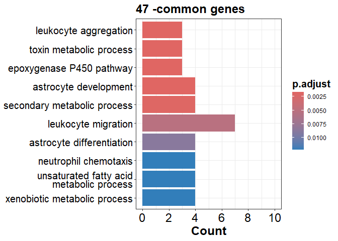<!-- -->

FIGURE 3

``` r
##########################################################################
# Reading in counts data

Gdata <- c4 

##########################################################################
#---------------------------------------------#
# Cardboard exposure group -Flaming

Gdata$CBF <- Gdata$CBF %>% mutate(ProbeID = rownames(Gdata$CBF))   

GdataCBf <- Gdata$CBF #Cardboard
GdataCBf <- select(GdataCBf, ProbeID, logFC)
rownames(GdataCBf) <- NULL

#making ranked gene list
genelist_GdataCBf = GdataCBf[,2] #numeric vector
names(genelist_GdataCBf) = as.character(GdataCBf[,1]) #named vector
genelist_GdataCBf = sort(genelist_GdataCBf, decreasing = TRUE) #must sort in descending order

#Performing GSEA analysis
#Gene Ontology (GO) 
gseGO_CBf_ALL <- gseGO(geneList=genelist_GdataCBf, 
                      ont ="ALL", 
                      keyType = "ENSEMBL", 
                      minGSSize = 10, #min size of gene sets for analysis
                      maxGSSize = 500, #max size of gene sets for analysis
                      pvalueCutoff = 0.05, 
                      eps = 0,
                      verbose = TRUE, 
                      OrgDb = organism, 
                      pAdjustMethod = "BH") #Bbenjamini Hochberg adjustment

#dotplot
enrichplot::dotplot(gseGO_CBf_ALL, split=".sign", title = "Cardboard -Flaming",
                    showCategory = 5, font.size = 15, 
                    label_format = 25) + facet_grid(.~.sign)+ 
  scale_x_continuous(breaks = seq(0, 1, by = 1), limits=c(0,1))+
  theme(axis.text.y = element_text(lineheight = 0.7, size = 15),
        title = element_text(size = 15, face="bold"))
```

<!-- -->

``` r
#--------------------------------------------------------------------#

#GO over-representation analysis
geneCBf <- names(genelist_GdataCBf[genelist_GdataCBf[] > 0.5]) # logFC > 0.5
enGOCBf <- enrichGO(gene         = geneCBf,
                   OrgDb         = org.Hs.eg.db,
                   keyType       = 'ENSEMBL',
                   ont           = "ALL",
                   pAdjustMethod = "BH",
                   pvalueCutoff  = 0.05,
                   qvalueCutoff  = 0.1)
head(enGOCBf)

#barplot
barplot(enGOCBf, showCategory=10, font = 15, title = "Cardboard -flaming")+ 
  scale_x_continuous(breaks = seq(0, 20, by = 5), limits=c(0,20))+
  theme(axis.text.y = element_text(lineheight = 0.7, size = 15),
        title = element_text(size = 15, face="bold"))
```

<!-- -->

``` r
##########################################################################
#---------------------------------------------#
# Plywood exposure group -Flaming

Gdata$PWF <- Gdata$PWF %>% mutate(ProbeID = rownames(Gdata$PWF))   

GdataPWf <- Gdata$PWF #Plywood

GdataPWf <- select(GdataPWf, ProbeID, logFC)
rownames(GdataPWf) <- NULL

#making ranked gene list
genelist_GdataPWf = GdataPWf[,2] #numeric vector
names(genelist_GdataPWf) = as.character(GdataPWf[,1]) #named vector
genelist_GdataPWf = sort(genelist_GdataPWf, decreasing = TRUE) #must sort in descending order

#Performing GSEA analysis
#Gene Ontology (GO) 
gseGO_PWf_ALL <- gseGO(geneList=genelist_GdataPWf, 
                      ont ="ALL", 
                      keyType = "ENSEMBL", 
                      minGSSize = 10, #min size of gene sets for analysis
                      maxGSSize = 500, #max size of gene sets for analysis
                      pvalueCutoff = 0.05,
                      eps=0,
                      verbose = TRUE, 
                      OrgDb = organism, 
                      pAdjustMethod = "BH") #Benjamini Hochberg adjustment

#dotplot
enrichplot::dotplot(gseGO_PWf_ALL, split=".sign", title = "Plywood -Flaming",
                    showCategory = 5, font.size = 15, 
                    label_format = 25) + facet_grid(.~.sign)+ 
  scale_x_continuous(breaks = seq(0, 1, by = 1), limits=c(0,1))+
  theme(axis.text.y = element_text(lineheight = 0.7, size = 15),
        title = element_text(size = 15, face="bold"))
```

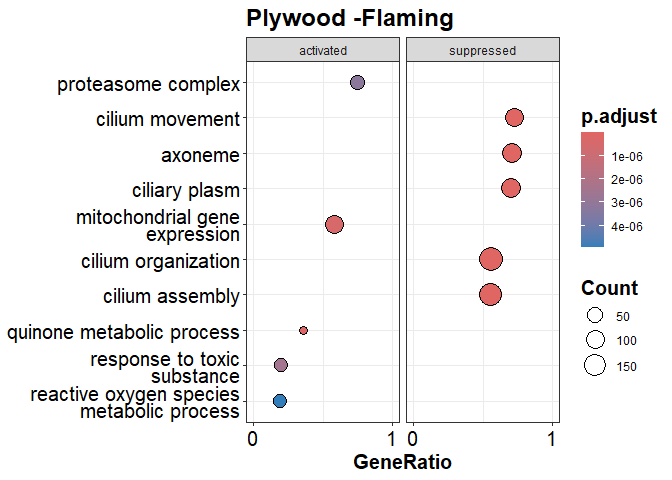<!-- -->

``` r
#--------------------------------------------------------------------#

#GO over-representation analysis
genePWf <- names(genelist_GdataPWf[genelist_GdataPWf[] > 0.5]) # logFC > 0.5
enGOPWf <- enrichGO(gene         = genePWf,
                   OrgDb         = org.Hs.eg.db,
                   keyType       = 'ENSEMBL',
                   ont           = "ALL",
                   pAdjustMethod = "BH",
                   pvalueCutoff  = 0.05,
                   qvalueCutoff  = 0.1)
head(enGOPWf)

#barplot
barplot(enGOPWf, showCategory=10, font = 15, title = "Plywood -flaming")+ 
  scale_x_continuous(breaks = seq(0, 20, by = 5), limits=c(0,20))+
  theme(axis.text.y = element_text(lineheight = 0.7, size = 15),
        title = element_text(size = 15, face="bold"))
```

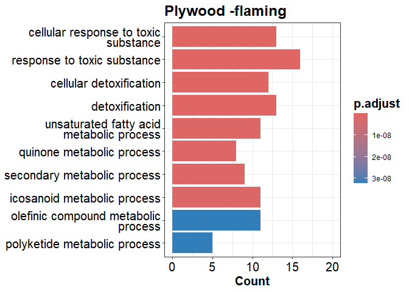<!-- -->

``` r
##########################################################################
#---------------------------------------------#
# Plastic exposure group -Flaming

Gdata$PLF <- Gdata$PLF %>% mutate(ProbeID = rownames(Gdata$PLF))   

GdataPLf <- Gdata$PLF #Plastic

GdataPLf <- select(GdataPLf, ProbeID, logFC)
rownames(GdataPLf) <- NULL

#making ranked gene list
genelist_GdataPLf = GdataPLf[,2] #numeric vector
names(genelist_GdataPLf) = as.character(GdataPLf[,1]) #named vector
genelist_GdataPLf = sort(genelist_GdataPLf, decreasing = TRUE) #must sort in descending order

#Performing GSEA analysis
#Gene Ontology (GO) 
gseGO_PLf_ALL <- gseGO(geneList=genelist_GdataPLf, 
                      ont ="ALL", 
                      keyType = "ENSEMBL", 
                      minGSSize = 10, #min size of gene sets for analysis
                      maxGSSize = 500, #max size of gene sets for analysis
                      pvalueCutoff = 0.05,
                      eps=0,
                      verbose = TRUE, 
                      OrgDb = organism, 
                      pAdjustMethod = "BH") #Benjamini Hochberg adjustment

#dotplot
enrichplot::dotplot(gseGO_PLf_ALL, split=".sign", title = "Plastic -Flaming",
                    showCategory = 5, font.size = 15, 
                    label_format = 25) + facet_grid(.~.sign)+ 
  scale_x_continuous(breaks = seq(0, 1, by = 1), limits=c(0,1))+
  theme(axis.text.y = element_text(lineheight = 0.7, size = 15),
        title = element_text(size = 15, face="bold"))
```

<!-- -->

``` r
#--------------------------------------------------------------------#

#GO over-representation analysis
genePLf <- names(genelist_GdataPLf[genelist_GdataPLf[] > 0.5]) # logFC > 0.5
enGOPLf <- enrichGO(gene         = genePLf,
                   OrgDb         = org.Hs.eg.db,
                   keyType       = 'ENSEMBL',
                   ont           = "ALL",
                   pAdjustMethod = "BH",
                   pvalueCutoff  = 0.05,
                   qvalueCutoff  = 0.1)
head(enGOPLf)

#barplot
barplot(enGOPLf, showCategory=10, size = 15, title = "Plastic -flaming")+ 
  scale_x_continuous(breaks = seq(0, 20, by = 5), limits=c(0,20))+
  theme(axis.text.y = element_text(lineheight = 0.7, size = 15),
        title = element_text(size = 15, face="bold"))
```

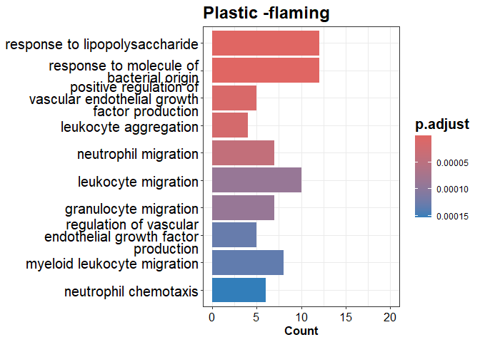<!-- -->

FIGURE E3

``` r
#--------------------------------------------------------------------#
# Enrichment Map:

gse1 <- pairwise_termsim(gseGO_CBf_ALL)
emapplot(gse1, showCategory = 10) + ggtitle("Cardboard -flaming")+
  theme(title = element_text(size = 15, face="bold"))
```

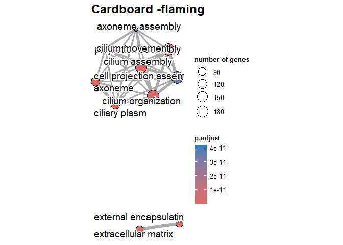<!-- -->

``` r
gse2 <- pairwise_termsim(gseGO_PWf_ALL)
emapplot(gse2, showCategory = 10) + ggtitle("Plywood -flaming")+
  theme(title = element_text(size = 15, face="bold"))
```

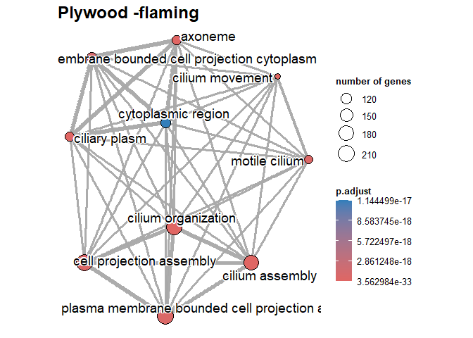<!-- -->

``` r
gse3 <- pairwise_termsim(gseGO_PLf_ALL)
emapplot(gse3, showCategory = 10) + ggtitle("Plastic -flaming")+
  theme(title = element_text(size = 15, face="bold"))
```

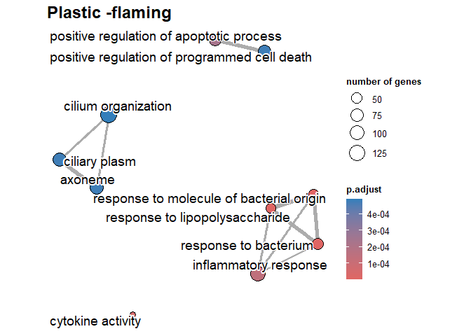<!-- -->

``` r
#--------------------------------------------------------------------#
```

FIGURE E2

``` r
a4S <- a4 %>% 
  keep(str_detect(names(a4), "Smoldering"))
names(a4S) <- sub('\nSmoldering','', names(a4S))

EP_All_S <- euler(a4S, shape = "ellipse") # Euler plot -smoldering
plot(EP_All_S, quantities = TRUE, cex = 5, labels = list(font = 3, cex = 1.5))
```

<!-- -->

FIGURE E4

``` r
#---------------------------------------------#
# Smoldering #
#---------------------------------------------#

# Cardboard exposure group -Smoldering
Gdata$CBS <- Gdata$CBS %>% mutate(ProbeID = rownames(Gdata$CBS))   
GdataCBs <- Gdata$CBS #Cardboard
GdataCBs <- select(GdataCBs, ProbeID, logFC)
rownames(GdataCBs) <- NULL

#making ranked gene list
genelist_GdataCBs = GdataCBs[,2] #numeric vector
names(genelist_GdataCBs) = as.character(GdataCBs[,1]) #named vector
genelist_GdataCBs = sort(genelist_GdataCBs, decreasing = TRUE) #must sort in descending order

#Performing GSEA analysis
#Gene Ontology (GO) 
gseGO_CBs_ALL <- gseGO(geneList=genelist_GdataCBs, 
                      ont ="ALL", 
                      keyType = "ENSEMBL", 
                      minGSSize = 10, #min size of gene sets for analysis
                      maxGSSize = 500, #max size of gene sets for analysis
                      pvalueCutoff = 0.05, 
                      eps = 0,
                      verbose = TRUE, 
                      OrgDb = organism, 
                      pAdjustMethod = "BH") #Benjamini Hochberg adjustment

#dotplot
enrichplot::dotplot(gseGO_CBs_ALL, split=".sign", title = "Cardboard -Smoldering",
                    showCategory = 5, font.size = 15,  label_format = 50) + facet_grid(.~.sign)+ 
  scale_x_continuous(breaks = seq(0, 1, by = 1), limits=c(0,1))+
  theme(axis.text.y = element_text(lineheight = 0.80, size = 15),
        title = element_text(size = 15, face="bold"),
        plot.title = element_text(hjust=0.5))+
  coord_fixed(ratio = 1, xlim = NULL, ylim = NULL, expand = TRUE, clip = "on") 
```

<!-- -->

``` r
#GO over-representation analysis
geneCBs <- names(genelist_GdataCBs[genelist_GdataCBs[] > 0.5]) # logFC > 0.5
enGOCBs <- enrichGO(gene         = geneCBs,
                   OrgDb         = org.Hs.eg.db,
                   keyType       = 'ENSEMBL',
                   ont           = "ALL",
                   pAdjustMethod = "BH",
                   pvalueCutoff  = 0.05,
                   qvalueCutoff  = 0.1)
head(enGOCBs)

#barplot
barplot(enGOCBs, showCategory=10, size = 15, title = "Cardboard -Smoldering")+ 
  scale_x_continuous(breaks = seq(0, 10, by = 5), limits=c(0,10))+
  theme(axis.text.y = element_text(lineheight = 0.7, size = 15),
        title = element_text(size = 15, face="bold"))+ coord_fixed(2)
```

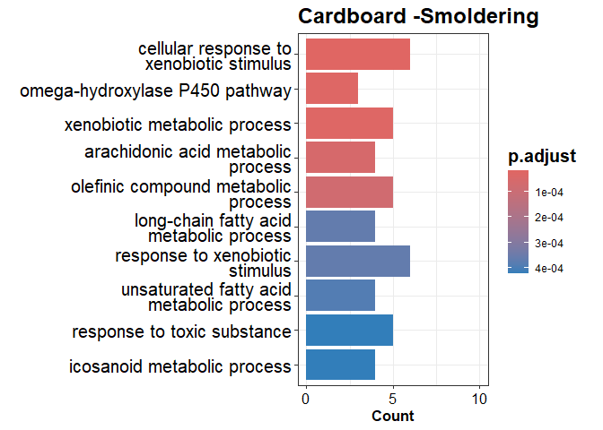<!-- -->

``` r
#---------------------------------------------------------------------#
# Plywood exposure group -Smoldering

Gdata$PWS <- Gdata$PWS %>% mutate(ProbeID = rownames(Gdata$PWS))   
GdataPWs <- Gdata$PWS #Plywood
GdataPWs <- select(GdataPWs, ProbeID, logFC)
rownames(GdataPWs) <- NULL

#making ranked gene list
genelist_GdataPWs = GdataPWs[,2] #numeric vector
names(genelist_GdataPWs) = as.character(GdataPWs[,1]) #named vector
genelist_GdataPWs = sort(genelist_GdataPWs, decreasing = TRUE) #must sort in descending order

#Performing GSEA analysis
#Gene Ontology (GO) 
gseGO_PWs_ALL <- gseGO(geneList=genelist_GdataPWs, 
                       ont ="ALL", 
                       keyType = "ENSEMBL", 
                       minGSSize = 10, #min size of gene sets for analysis
                       maxGSSize = 500, #max size of gene sets for analysis
                       pvalueCutoff = 0.05, 
                       eps = 0,
                       verbose = TRUE, 
                       OrgDb = organism, 
                       pAdjustMethod = "BH") #Benjamini Hochberg adjustment


#dotplot
enrichplot::dotplot(gseGO_PWs_ALL, split=".sign", title = "Plywood -Smoldering",
                    showCategory = 5, font.size = 15,  label_format = 50) + facet_grid(.~.sign)+ 
  scale_x_continuous(breaks = seq(0, 1, by = 1), limits=c(0,1))+
  theme(axis.text.y = element_text(lineheight = 0.80, size = 15),
        title = element_text(size = 15, face="bold"),
        plot.title = element_text(hjust=0.5))+
  coord_fixed(ratio = 1, xlim = NULL, ylim = NULL, expand = TRUE, clip = "on")
```

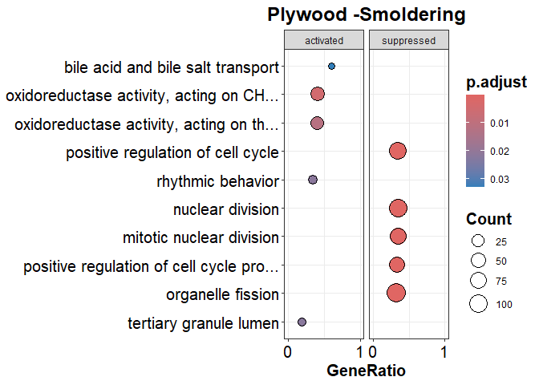<!-- -->

``` r
#GO over-representation analysis
genePWs <- names(genelist_GdataPWs[genelist_GdataPWs[] > 0.5]) # logFC > 0.5
enGOPWs <- enrichGO(gene         = genePWs,
                    OrgDb         = org.Hs.eg.db,
                    keyType       = 'ENSEMBL',
                    ont           = "ALL",
                    pAdjustMethod = "BH",
                    pvalueCutoff  = 0.05,
                    qvalueCutoff  = 0.1)
head(enGOPWs)

#barplot
barplot(enGOPWs, showCategory=10, size = 15, title = "Plywood -Smoldering")+ 
  scale_x_continuous(breaks = seq(0, 10, by = 5), limits=c(0,10))+
  theme(axis.text.y = element_text(lineheight = 0.7, size = 15),
        title = element_text(size = 15, face="bold"))+ coord_fixed(2)
```

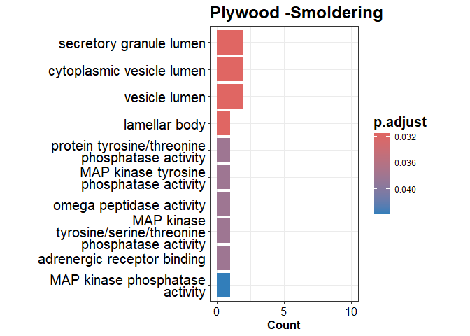<!-- -->

``` r
#---------------------------------------------------------------------#
# Plastic exposure group -Smoldering

Gdata$PLS <- Gdata$PLS %>% mutate(ProbeID = rownames(Gdata$PLS))   
GdataPLs <- Gdata$PLS #Plywood
GdataPLs <- select(GdataPLs, ProbeID, logFC)
rownames(GdataPLs) <- NULL

#making ranked gene list
genelist_GdataPLs = GdataPLs[,2] #numeric vector
names(genelist_GdataPLs) = as.character(GdataPLs[,1]) #named vector
genelist_GdataPLs = sort(genelist_GdataPLs, decreasing = TRUE) #must sort in descending order

#Performing GSEA analysis
#Gene Ontology (GO) 
gseGO_PLs_ALL <- gseGO(geneList=genelist_GdataPLs, 
                       ont ="ALL", 
                       keyType = "ENSEMBL", 
                       minGSSize = 10, #min size of gene sets for analysis
                       maxGSSize = 500, #max size of gene sets for analysis
                       pvalueCutoff = 0.05, 
                       eps = 0,
                       verbose = TRUE, 
                       OrgDb = organism, 
                       pAdjustMethod = "BH") #Benjamini Hochberg adjustment

#dotplot
enrichplot::dotplot(gseGO_PLs_ALL, split=".sign", title = "Plastic -Smoldering",
                    showCategory = 5, font.size = 15, label_format = 50) + facet_grid(.~.sign)+ 
  scale_x_continuous(breaks = seq(0, 1, by = 1), limits=c(0,1))+
  theme(axis.text.y = element_text(lineheight = 0.80, size = 15),
        title = element_text(size = 15, face="bold"),
        plot.title = element_text(hjust=0.5))+
  coord_fixed(ratio = 1, xlim = NULL, ylim = NULL, expand = TRUE, clip = "on") 
```

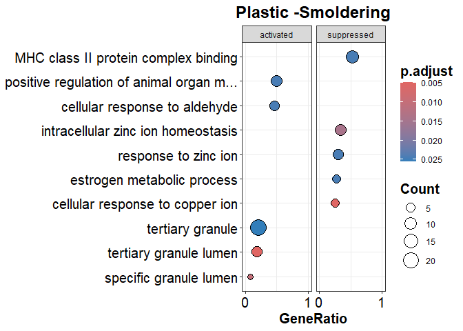<!-- -->

``` r
#GO over-representation analysis
genePLs <- names(genelist_GdataPLs[genelist_GdataPLs[] > 0.5]) # logFC > 0.5
enGOPLs <- enrichGO(gene         = genePLs,
                    OrgDb         = org.Hs.eg.db,
                    keyType       = 'ENSEMBL',
                    ont           = "ALL",
                    pAdjustMethod = "BH",
                    pvalueCutoff  = 0.05,
                    qvalueCutoff  = 0.1)
head(enGOPLs)

#barplot
barplot(enGOPLs, showCategory=10, font = 15, title = "Plastic -Smoldering")+
scale_x_continuous(breaks = seq(0, 10, by = 5), limits=c(0,10))+
  theme(axis.text.y = element_text(lineheight = 0.7, size = 15),
        title = element_text(size = 15, face="bold"))+ coord_fixed(2)
```

<!-- -->

Figure 4

``` r
###########################################################
# CORRELATION WITH CHEMICAL COMPOUNDS
##########################################################################

# Reading in PAH values 
# in burn pit smoke condensates

ChCs <- read_excel("chemical_concentrations.xlsx", 
                   sheet=1, 
                   col_names = TRUE)
ChCs <- as.data.frame(ChCs)
ChCs <- as.matrix(ChCs)
head(ChCs)

row.names(ChCs) <- ChCs[,1]

ChCs <- ChCs[,2:ncol(ChCs)]
ChCs <- t(ChCs)

head(ChCs)
sapply(ChCs, class) #to make sure that ChC columns are numeric
mode(ChCs) <- "numeric" # Changing matrix to numeric

#-----------------------------------------------------------------------#
# Reading in inorganic element values 
# in burn pit smoke condensates

IEs <- read_excel("chemical_concentrations.xlsx", 
                   sheet=2, 
                   col_names = TRUE)
IEs <- as.data.frame(IEs)
IEs <- as.matrix(IEs)
head(IEs)

row.names(IEs) <- IEs[,1]

IEs <- IEs[,2:ncol(IEs)]
IEs <- t(IEs)

head(IEs)
sapply(IEs, class) #to make sure that IE columns are numeric
mode(IEs) <- "numeric" # Changing matrix to numeric


#-----------------------------------------------------------------------#
counts_ALL <- counts %>% select(!ends_with("CTRL")) # selecting all samples
                                                    # except control


counts_ALL <- subset(counts_ALL, rownames(counts_ALL) %in% c(unlist(z[7,3])))

counts_ALL <- counts_ALL %>% rownames_to_column(var = "transcripts")

counts_ALL <- counts_ALL %>% pivot_longer(cols = -1, names_to = "SampleID", values_to = "count") 
counts_ALL$SampleID <- substr(counts_ALL$SampleID, 4, nchar(counts_ALL$SampleID))

counts_ALL$SampleID <- str_replace_all(counts_ALL$SampleID, 
                                       c(CBFh = "Cardboard Flaming",
                                         CBSh = "Cardboard Smoldering",
                                         PLFh = "Plastic Flaming",
                                         PLSh = "Plastic Smoldering",
                                         PWFh = "Plywood Flaming",
                                         PWSh = "Plywood Smoldering"))

colnames(counts_ALL)

counts_ALL <- counts_ALL %>%
  group_by(transcripts, SampleID) %>%
  summarise(across(everything(), sum))

counts_ALL <- counts_ALL %>% pivot_wider(names_from = "SampleID", values_from = "count") %>%
  column_to_rownames(var = "transcripts")

counts_ALL$gene <- mapIds(org.Hs.eg.db, keys = row.names(counts_ALL), 
                            keytype = "ENSEMBL", column = "SYMBOL", 
                            multiVals="first") #adding gene names 
counts_ALL <- subset(counts_ALL, counts_ALL$gene != 'NA')
rownames(counts_ALL) <- NULL
rownames(counts_ALL) <- counts_ALL$gene
counts_ALL <- counts_ALL[,1:(ncol(counts_ALL)-1)]

counts_ALL <- t(counts_ALL)

##################################################################
# Pearson' test to detect correlation

cor.matrix <-corr.test(counts_ALL, ChCs, 
                           adjust = "none", method = "pearson")

corrplot(t(cor.matrix$r), order="original", tl.col = "black",
         p.mat = t(cor.matrix$p), sig.level = 0.05, insig = "blank",
         title ="PAHs", tl.srt = 45, 
         tl.cex = 0.7, mar=c(0,0,1,0)) # significance level p<0.05
```

<!-- -->

``` r
cor.matrix2 <-corr.test(counts_ALL, IEs, 
                       adjust = "none", method = "pearson")

corrplot(t(cor.matrix2$r), order="original", tl.col = "black",
         p.mat = t(cor.matrix2$p), sig.level = 0.05, insig = "blank",
         title ="Inorganic elements", tl.srt = 45, 
         tl.cex = 0.7, mar=c(0,0,1,0)) # significance level p<0.05
```

<!-- -->

SAVING TABLE with significant DEGs in each exposure group

``` r
#---------------------------------------------------#
names(b4) <- str_replace_all(names(b4), c(CBF= "Cardboard Flaming",
                                          CBS= "Cardboard Smoldering",
                                          PLF= "Plastic Flaming",
                                          PLS= "Plastic Smoldering",
                                          PWF= "Plywood Flaming",
                                          PWS= "Plywood Smoldering"))

blank_excel <- createWorkbook()

Map(function(df, tab_name){     
  
  addWorksheet(blank_excel, tab_name)
  writeData(blank_excel, tab_name, df)
}, 

b4, names(b4)
)

saveWorkbook(blank_excel, file = "Table S1.xlsx", overwrite = TRUE)
```
